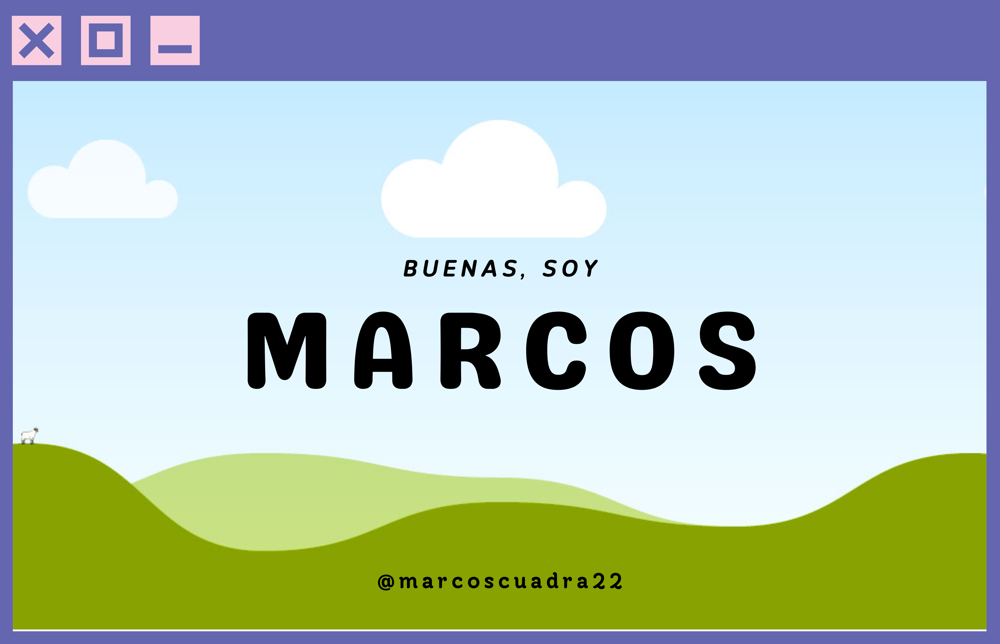

<!-- Mi banner -->

        

<!-- Separador animado de instancias -->

<!-- Icono y presentacion sonbre mi -->
## <picture></picture> **Sobre Mi:**

- Soy estudiante de Desarrollador de Aplicaciones Multiplataforma. 
- Mi idea es seguir formándome y conseguir la gran variedad de curos sobre los diferentes tipos de lenguajes de programación y similares para conseguir ser full stack. 
- Fan de la programación y disfrutando del camino.

<!-- Separador animado de instancias -->

<!-- Icono y mis redes sociales -->
## 🌐 Redes Sociales:
]
[]

<!-- Separador animado de instancias -->

<!-- Icono y todos mis lenguajes y similares -->
## <b> Tecnologias:</b>

 
 
 
 
 
 
 
 
 
 
 

<!-- Separador animado de instancias -->

<!-- Widget de los lenguajes mas usados -->

        

<!-- Separador animado de instancias -->

<!-- Despedida de mi README -->

        
        
Mi Perfil :) 

